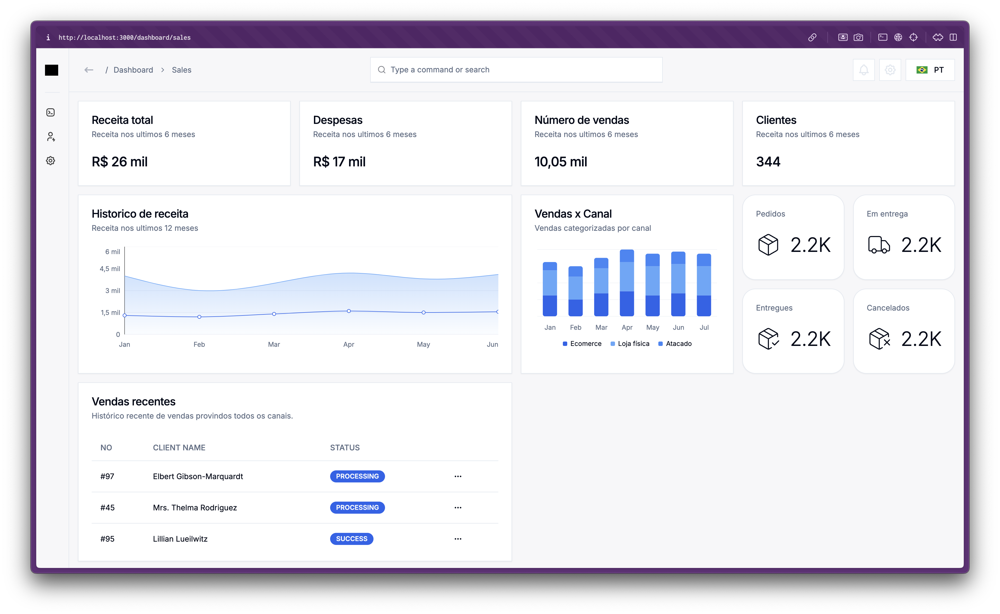

# Dashboard DEMO




Live DEMO: https://dashboard-demo-ghk8iqqvs-vitor852s-projects.vercel.app

This project is a web application developed in React and Next.js that allows users to manage and visualize sales data.

### Technologies Used

- [Next.js](https://nextjs.org/) - React framework for server-side and static applications.
- [React](https://reactjs.org/) - JavaScript library for building user interfaces.
- [TailwindCSS](https://tailwindcss.com/) - For styling components.
- [TypeScript](https://www.typescriptlang.org/) - A superset of JavaScript that adds static typing.

### Features

Currently, all features are being tested and will be published soon.

- **User Authentication**: Allows users to create accounts and log in.
- **Sales Management**: Users can add, edit, and delete sales records.
- **Data Analysis**: Various analyses and charts on the data.
- **Responsive Design**: The application adapts to different screen sizes.

## Getting Started

### Prerequisites

Make sure you have [Node.js](https://nodejs.org/) and [npm](https://www.npmjs.com/) installed on your machine.

### Installation

1. Clone the repository:

   ```bash
   git clone https://github.com/yourusername/your-repository.git
   cd your-repository
   ```

2. Install the dependencies:

   ```bash
   npm install
   ```

3. Start the development server:

   ```bash
   npm run dev
   ```

4. Open your browser and go to [http://localhost:3000](http://localhost:3000).

This project is a web application developed in React and Next.js that allows users to manage and visualize sales data.

### Technologies Used

- [Next.js](https://nextjs.org/) - React framework for server-side and static applications.
- [React](https://reactjs.org/) - JavaScript library for building user interfaces.
- [TailwindCSS](https://tailwindcss.com/) - For styling components.
- [TypeScript](https://www.typescriptlang.org/) - A superset of JavaScript that adds static typing.

### Features

Currently, all features are being tested and will be published soon.

- **User Authentication**: Allows users to create accounts and log in.
- **Sales Management**: Users can add, edit, and delete sales records.
- **Data Analysis**: Various analyses and charts on the data.
- **Responsive Design**: The application adapts to different screen sizes.

## Getting Started

### Prerequisites

Make sure you have [Node.js](https://nodejs.org/) and [npm](https://www.npmjs.com/) installed on your machine.

### Installation

1. Clone the repository:

   ```bash
   git clone https://github.com/yourusername/your-repository.git
   cd your-repository
   ```

2. Install the dependencies:

   ```bash
   npm install
   ```

3. Start the development server:

   ```bash
   npm run dev
   ```

4. Open your browser and go to [http://localhost:3000](http://localhost:3000).
